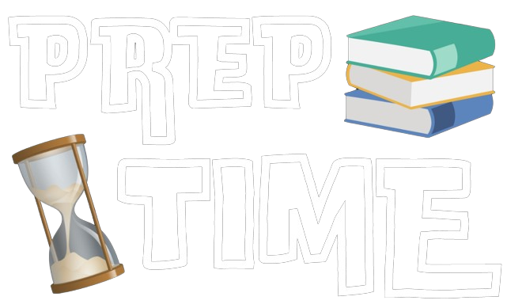

A Time Management Tool for Students

## Table of Contents

- [Table of Contents](#table-of-contents)
- [What is PrepTime](#what-is-preptime)
  - [Built With](#built-with)
- [How to use PrepTime](#how-to-use-preptime)
  - [Clock](#clock)
  - [Timer](#timer)
  - [Full Length Test](#full-length-test)
  - [Show Report](#show-report)

## What is PrepTime

PrepTime is a comprehensive tool that will help students in optimizing their study routines and enhancing academic performance. It offers a range of features to facilitate efficient study management and performance analysis:

- Study Time Analysis
- Test Analysis
- Performance Insights
- Last 10 test analysis
- The streak feature helps in motivating students to maintain consistency

### Built With

This project was built with the following technologies:

- [Next.js](https://nextjs.org/)
- [React](https://react.dev/)
- [NextUI](https://nextui.org/)
- [Tailwind CSS](https://tailwindcss.com/)
- [React Tostify](https://www.npmjs.com/package/react-toastify)
- [React Clock](https://projects.wojtekmaj.pl/react-clock/)
- [React-Chartjs](https://react-chartjs-2.js.org/)

## How to use PrepTime

To use PrepTime you can either go to its web app - [PrepTime](https://preptime.vercel.app/) or download its App [click to Download App](https://github.com/abhi887449/preptime/blob/main/AndroidAppData/PrepTime/app/release/app-release.apk). Features of PrepTime is explained below -

### `Clock`

The inclusion of the clock feature in PrepTime serves as a crucial
time-tracking tool for students. By allowing students to monitor the
duration of their study sessions, the clock feature empowers
students to manage their time effectively and make the most out of
their study sessions. It provides valuable insights into their study
habits, helping them allocate their time more efficiently and
maintain a balanced approach to learning.

### `Timer`

The timer feature helps students set a timer for a specified
interval of time and receive notifications. I extended this feature
by adding an auto-repeat option, allowing students to receive
notifications after each interval of time they specify.

### `Full Length Test`

This feature will assist students during full-length tests. They can
set the test timer when they begin the test and proceed to solve
their paper. Each button serves the following purpose:

- `Start` : This button is used to start the test timer after specifying the test time.
- `Reset` : This button is used to reset the test timer if needed.
- `Completed` : Students will use this button when they complete their answer. By clicking the "Completed" button, they can add a timestamp to the test data indicating that the question has been solved.
- `Skip` : Students will use this button when they are unable to solve a question and wish to skip it. By clicking the "Skip" button, they can add a timestamp to the test data indicating that the question has not been solved.
- `Save Test Data` : Students will use this button when they want to add test data to the main test list. This test data will be used to analyze student performance.
- `Save Test Data and End Test`: Students will use this button when they want to add test data to the main test list and navigate directly to the report page for analysis.

### `Show Report`

Here, students will receive a brief description of their performance, including details such as total study hours, performance in the last 10 tests, and a comprehensive view of all test data. This information empowers them to prepare effectively for their exams by understanding their strengths and areas for improvement.
